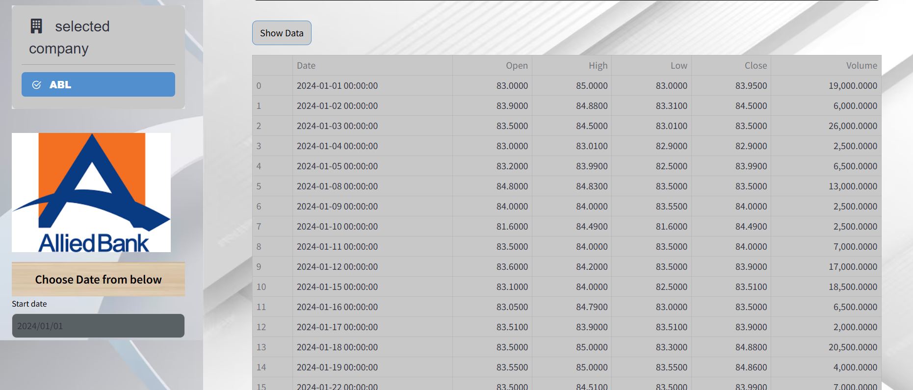

# 🖥️ NamalSpot

NamalSpot was a website created using Streamlit for Stock Price prediction using Machine Learning. This Website Shows Data of A Total of 98 companies of Pakistan. The data used in this Website is Real-Time and has a date Input for filtering of Data. Moreover, this Website also provides Real-Time data for Kibor Rates and Graphs for  Eps and Dividend.The Second Page of this Website Provides Details about 98 Companies.


## ♨️ Interface Design

The Interface Design was made with streamlit and is further styled by using CSS. the website has some of the HTML injected
into it.

## 🔤 Languages Used in Website


## 🔒 Run Locally
To Run Locally do the following steps:

Clone the project

```bash
  git clone https://github.com/ARKhan33/final_web.git
```
Install dependencies

```bash
  pip install -r requirements.txt
```
Go to the project directory,open command prompt and run

```bash
  streamlit run app.py
```

## 🖼️ Screenshots




